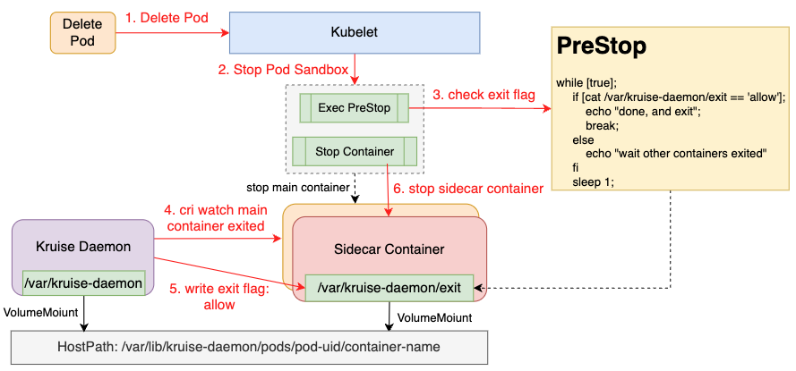

# ContainerExitPriority

## Table of Contents

A table of contents is helpful for quickly jumping to sections of a proposal and for highlighting
any additional information provided beyond the standard proposal template.
[Tools for generating](https://github.com/ekalinin/github-markdown-toc) a table of contents from markdown are available.

- [Title](#title)
- [Table of Contents](#table-of-contents)
- [Motivation](#motivation)
- [Proposal](#proposal)
  - [API Definition](#api-definition)
  - [Implementation](#implementation)
- [Relationship With TerminationGracePeriodSeconds](#relationship-with-terminationGracePeriodSeconds)
- [SidecarSet In-place Update](#sidecarset-in-place-update)

## Motivation

Pods generally contain a variety of sidecar containers in addition to the main container that runs the main business logic, for example, logAgent, ServiceMesh Envoy, etc.
Based on the feature that the sidecar container is for the main container, there is a common expectation that the sidecar container can be started before the main container and exited after the main container.

However, in Kubernetes, there is no mechanism to do special handling of sidecar containers, especially when deleting pods, kubelet will stop all containers in pods in parallel,
which often leads to the situation that sidecar containers exit before main container, which in turn causes the risk of business main container abnormalities.

This paper aims to design a general mechanism to precisely control the exit order of sidecar containers.

## Proposal
This solution establishes a generic exit mechanism for sidecar containers. The kruise-daemon shares the /var/lib/kruise-daemon directory with sidecar containers,
and the preStop /var/lib/kruise-daemon/entrypoint script determines when sidecar is allowed to exit, thus achieving the effect of controlling the exit order of sidecar containers.

### API Definition
```yaml
apiVersion: v1
kind: Pod
metadata:
  name: echoserver
  annotations:
    # 1. sidecar containers exit priority definition
    # 2. The 'larger' the number, the 'later' the exit, the default is '0'. As follows, the containers exit order is main -> envoy -> log-agent.
    # 3. annotation with KRUISE_EXIT_PRIORITY environment variable are optional
    kruise.io/container-exit-priority: '{"log-agent":2, "envoy":1}'
spec:
  // webhook auto-injection, volumes and volumeMounts configuration
  volumes:
  - name: kruise-daemon
    hostPath:
      path: /var/lib/kruise-daemon/pods/{pod.uid}
      type: "Directory"
  containers:
  - name: log-agent
    image: log-agent:latest
    env:
    - name: "KRUISE_EXIT_PRIORITY"
      value: "2"
    lifecycle:
      preStop:
        exec:
          # webhook auto-injection, and complete preStop command script splicing
          command:
          # The built-in binary for kruise-daemon, implementation reference: [argo-cd pipeline](https://github.com/tektoncd/pipeline/tree/main/cmd/entrypoint)
          # This binary is used to override the command of preStop by wrapping it and executing original preStop command in a subprocess.
          - /var/lib/kruise-daemon/entrypoint
          # kruise entrypoint has built-in logic that determines when to exit by whether the /var/lib/kruise-daemon/exit content is allow or not.
          - -check-whether-exit
          # if sidecar is configured with preStop command, splice it after '-entrypoint'.
          - -entrypoint
          - /bin/sh
          - --
          - -c
          - |
            /home/log-agent/bin/prestop.sh
    volumeMounts:
    - name: kruise-daemon
      mountPath: /var/lib/kruise-daemon
      subPath: log-agent
  - name: envoy
    image: envoy:latest
    env:
    - name: "KRUISE_EXIT_PRIORITY"
      value: "1"
    lifecycle:
      preStop:
        exec:
          command:
          - /var/lib/kruise-daemon/entrypoint
          - -check-whether-exit
          - -entrypoint
          - /bin/sh
          - --
          - -c
          - |
            /usr/local/bin/pilot-agent exit
    volumeMounts:
    - name: kruise-daemon-envoy
      mountPath: /var/lib/kruise-daemon
      subPath: envoy
  # business main container, providing echoserver services
  - name: main
    image: echoserver:latest
```

### Implementation



1. The preStop script first creates the 'exit' file and then loop determine if exit is allowed, as follows:
```shell
rm -f /var/lib/kruise-daemon;
touch /var/lib/kruise-daemon;
while [ true ];
  do
    content=`cat /var/lib/kruise-daemon/exit`;
    if [[ $content =~ "allow" ]];then
      rm -f /var/lib/kruise-daemon;
      echo "other containers has exit, and starting exit";
      break;
    else
      echo "waiting main container exit";
    fi;
    sleep 1;
  done
```
2. kruise-daemon fsnotify /var/lib/kruise-daemon, discovery of exit file creation, check Pod.DeletionTimestamp!=nil, then executing container exit priority logic
3. when other high-priority containers have exited, kruise-daemon echo 'allow' > /var/lib/kruise-daemon/exit
4. after the preStop script finds that exit is allowed, it first deletes the /var/lib/kruise-daemon/exit file and then starts stopping container
5. In the second step, if Pod.DeletionTimestamp==nil, it is judged to be SidecarSet in-place upgrade scenario,
and step 3 is executed immediately to ensure the successful completion of the in-place upgrade
6. Cleanup share volume: the controller regularly(one minute) cleans up the share volume, if the pod corresponding to this volume does not exist.

Note: If the above is not applied to the shared volume approach, but the 'exec' notification approach, there is no good way for kruise-daemon to actively discover this behavior in the sidecarSet in-place upgrade scenario.
The core point of the above shared volume solution is that by fsnotify the shared directory(/var/lib/kruise-daemon) and be able to actively listen to the preStop behavior and trigger the exit priority logic.

## Relationship With TerminationGracePeriodSeconds

terminationGracePeriodSeconds is the longest waiting time for containers to exit in pod, and the sidecar exit priority function above is also bound by this time.
If the sidecar container does not exit after the terminationGracePeriodSeconds time is reached (e.g., the preStop script does not return), the kubelet will directly execute the stop sidecar container operation.
In this case, the exit order of the sidecar container is not guaranteed, i.e., it may exit at the same time or before the main container. Two factors are common when this happens:
1. the terminationGracePeriodSeconds configuration is unreasonable, which needs to be adjusted by the business according to the actual scenario.
2. the main exit logic is abnormal, resulting in stopping the main container timeout, which requires business development to fix the exit logic of the main container by checking the log of the main container.

## SidecarSet In-place Update

SidecarSet is the workload defined by OpenKruise for injecting and managing sidecar containers, and it has the ability to upgrade sidecar containers in-place. For details please refer to: [SidecarSet](https://openkruise.io/docs/user-manuals/sidecarset/).

In the current in-place upgrade sidecar container scenario, disregarding the sidecar container exit order capability for now,
the built-in logic of kruise-daemon will determine whether it is an in-place upgrade scenario and set /var/lib/kruise-daemon/exit content to allow, thus achieving the effect of fast in-place upgrade.
